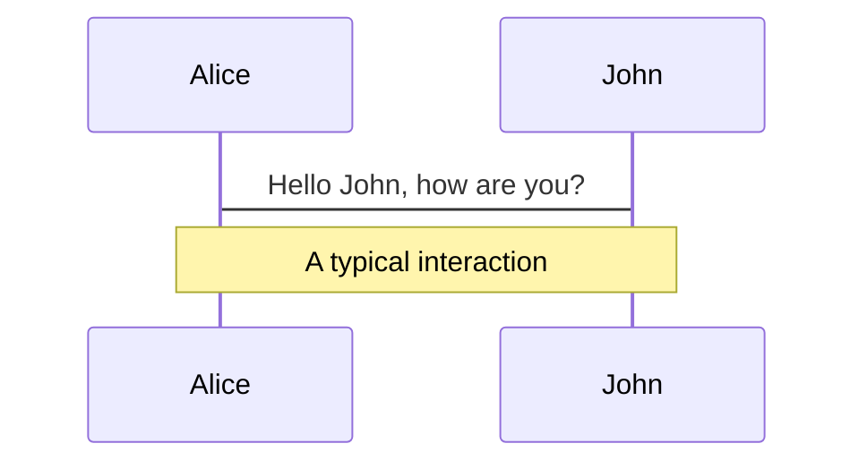
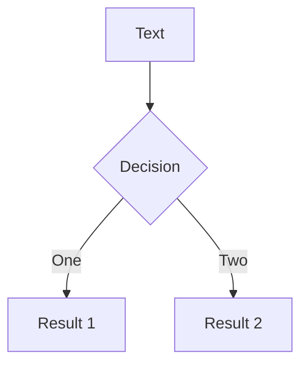
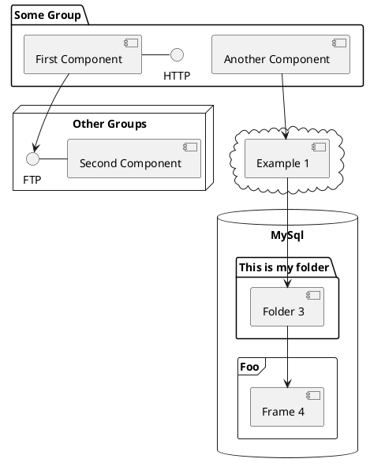

---
# try also 'default' to start simple
theme: light-icons
# random image from a curated Unsplash collection by Anthony
# like them? see https://unsplash.com/collections/94734566/slidev
background: https://source.unsplash.com/collection/94734566/1920x1080
# apply any windi css classes to the current slide
class: 'text-center'
# https://sli.dev/custom/highlighters.html
highlighter: shiki
# show line numbers in code blocks
lineNumbers: false
# some information about the slides, markdown enabled
info: |
  ## Slidev Starter Template
  Presentation slides for developers.

  Learn more at [Sli.dev](https://sli.dev)
# persist drawings in exports and build
drawings:
  persist: false
# use UnoCSS (experimental)
css: unocss
---

# Ractors

Ruby Parallel Computing (with Ruby Actors)

Bill Tihen

---
layout: image-right
image: /images/british-library-Gw_UOoFk4Wk-unsplash.jpg
---

# Outline

* Defined
* Comparison
* Components
* Life-cycle
* Communication
* Usage Examples
* Simple Ractor Webserver

Photo by <a href="https://unsplash.com/@britishlibrary?utm_source=unsplash&utm_medium=referral&utm_content=creditCopyText">British Library</a> on <a href="https://unsplash.com/s/photos/map?utm_source=unsplash&utm_medium=referral&utm_content=creditCopyText">Unsplash</a>

---
layout: image-left
image: /images/kyle-head-p6rNTdAPbuk-unsplash.jpg
---

## Defined - **Ruby Actors** (Ractors)

Ruby’s Actor-like concurrent abstraction

Parallel computing with object safety using an actor like model using message passing instead of object sharing.

This is very helpful with heavy CPU tasks that can be split into sensible independent tasks.

_**NOTE**: Not all tasks are faster using Ractors._

<small>Photo by <a href="https://unsplash.com/@kyleunderscorehead?utm_source=unsplash&utm_medium=referral&utm_content=creditCopyText">Kyle Head</a> on <a href="https://unsplash.com/photos/p6rNTdAPbuk?utm_source=unsplash&utm_medium=referral&utm_content=creditCopyText">Unsplash</a></small>

---
layout: image-right
image: /images/joe-neric-AkEMVbdEmUQ-unsplash.jpg
---

## Comparison

Using Fibonacci recursion:

```ruby
def fibonacci(n) = n < 2 ? 1 : fibonacci(n-2) + fibonacci(n-1)
```

| **Code Method** | **Time (Sec)** | **Notes**                  |
| ----------------| ----------:|:-------------------------------|
| **Ractor**     | **7.9** | _4 Ractors - results random order_ |
| Multi-Threaded | 17.3    | 4 Threads - results random order   |
| Single Thread  | 17.4    | Main Thread - sequential results   |

**Note**: not all algorithms are faster with Ractors.

Photo by <a href="https://unsplash.com/@jneric?utm_source=unsplash&utm_medium=referral&utm_content=creditCopyText">Joe Neric</a> on <a href="https://unsplash.com/collections/2337461/comparison-meeting?utm_source=unsplash&utm_medium=referral&utm_content=creditCopyText">Unsplash</a>

---
layout: image-left
image: /images/01_ractor_components.png
---

## Components

* **in-port** - accepts messages when open
* **queue** (Mailbox) - Infinite (limited by RAM)
* **data** - isolated data to be used in execution
* **code** - code that executes
* **out-port** - open when the Ractor has results to share (queue length of 1)

---
layout: image-right
image: /images/evie-s-zn4Pl32WgWM-unsplash.jpg
---
# Lifecycle

* A Ractor is basically alive as long as a port (in or out) is open.
* While a port is open the Ractor is **blocking** (waiting) - the incoming port needs to be in an infinite loop - otherwise it closes after the first message.
* The Queue is by default first in first out.  The queue length is infinite (limited by memory).
* The outgoing port is open as soon as the Ractor as finished processing a message (the outgoing )
* A Ractor processes a message when the outgoing port is closed (nothing queued) and two there is a message to computing in the incoming port.
* Ractors 'die' if the experience an exception (and kill all downstream Ractors too)


Photo by <a href="https://unsplash.com/@evieshaffer?utm_source=unsplash&utm_medium=referral&utm_content=creditCopyText">Evie S.</a> on <a href="https://unsplash.com/images/people/life?utm_source=unsplash&utm_medium=referral&utm_content=creditCopyText">Unsplash</a>

---
layout: image-left
image: /images/ishan-seefromthesky-4xmgrNUbyNA-unsplash.jpg
---

## Short lived (single use) Ractor

```ruby
integer = 1

r1 = Ractor.new(integer, name: 'r1') do |i|
  puts "Executing #{i} + 2"
  i + 2
end

r1.inspect # => "#<Ractor:#1 r1 (irb):8 terminated>"

r1.send(1) # `send': The incoming-port is already closed (Ractor::ClosedError)

r1.take # outport is open, waiting for the result to be taken
# => 3

r1.take # `take': The outgoing-port is already closed (Ractor::ClosedError)
```

Photo by <a href="https://unsplash.com/@seefromthesky?utm_source=unsplash&utm_medium=referral&utm_content=creditCopyText">Ishan @seefromthesky</a> on <a href="https://unsplash.com/s/photos/single-use?utm_source=unsplash&utm_medium=referral&utm_content=creditCopyText">Unsplash</a>


---
layout: image-right
image: /images/matt-seymour-8X2siC3gSj4-unsplash.jpg
---

## Long lived (multi-use) Ractor

```ruby
r1 = Ractor.new(name: 'r1') do
  loop do # internal Ractor infinite loop allows multi-use
    input = Ractor.receive # receive pulls from the inbox
    result = input + 2
    puts "Executed - result will be: #{result}"
    Ractor.yield(result)
  end
end
r1.inspect # waiting for input => #<Ractor :#8 r1 blocking>
r1.send(1) # puts is seen immediately (since outport is open)

# we can add messages to the incoming queue
r1.send(2) # doesn't execute since output has a result
r1.take # get first result & process next message
# => 3

r1.take # get result, nothing in the queue, nothing executes
# => 4
r1.take # closed outport error since nothing is in its queue
```

Photo by <a href="https://unsplash.com/@mattseymour?utm_source=unsplash&utm_medium=referral&utm_content=creditCopyText">Matt Seymour</a> on <a href="https://unsplash.com/s/photos/circular?utm_source=unsplash&utm_medium=referral&utm_content=creditCopyText">Unsplash</a>

---
layout: image-left
image: /images/yogendra-singh-BxHnbYyNfTg-unsplash.jpg
---

## Sudden Death (Exceptions)

```ruby
integer = 'a'

# automatically queues & processes the message
r1 = Ractor.new(integer, name: 'doomed') { |i| i + 2 }
#<Thread:0x0000000104373ae8 run> terminated with exception (report_on_exception is true):
# (irb):16:in `+': no implicit conversion of Integer into String (TypeError) from (irb):16:in `block in <top (required)>'
# => #<Ractor:#4 doomed (irb):16 running>

# because the Ractor was build and immediately tried to process
# the return messages are in an odd order.
# actually checking the status confirms it died
r1.inspect
# => "#<Ractor:#9 r1 (irb):58 terminated>"
```

Photo by <a href="https://unsplash.com/@yogendras31?utm_source=unsplash&utm_medium=referral&utm_content=creditCopyText">Yogendra Singh</a> on <a href="https://unsplash.com/s/photos/problem?utm_source=unsplash&utm_medium=referral&utm_content=creditCopyText">Unsplash</a>

---
layout: image-right
image: /images/guilherme-stecanella-SZ80v2lmhSY-unsplash.jpg
---

## Communications / Usage

```
Ports/Commands:   +---------------------------------------+
    r.send(obj) ->*->[incoming queue]  Ractor.yield(obj)->*-> r.take
                  |         v                 ^           |
Ractor r          |   Ractor.receive -> Code Execution    |
                  +---------------------------------------+

Push Pipeline:    +----------+    r2: +-------------------+
              r1: | r2.send->|------->*-> Ractor.receive  *
                  +--------0-+        +-------------------+

Pull Pipeline:    +-------------------+     r2: +---------+
              r1: * Ractor.yield(obj) *-------->- r1.take |
                  +-------------------+         +---------+

Pull from Pool:   +--------------------+
              r1: * Ractor.yield(obj)->*--+
                  +--------------------+  |
                                          +-> Ractor.select(r1, r2)
                  +--------------------+  |   (Waiting on Ractors)
              r2: * Ractor.yield(obj)->*-=+
                  +--------------------+
```

Photo by <a href="https://unsplash.com/@guilhermestecanella?utm_source=unsplash&utm_medium=referral&utm_content=creditCopyText">Guilherme Stecanella</a> on <a href="https://unsplash.com/s/photos/message?utm_source=unsplash&utm_medium=referral&utm_content=creditCopyText">Unsplash</a>

---
layout: image-left
image: /images/kira-auf-der-heide-gKFD0IVMk3s-unsplash.jpg
---

## Usage Examples

* Ring
* Fork-Join
* Pipeline
* Worker-Pool
* Supervision

---
layout: image-right
image: /images/matheo-jbt-HLhvZ9HRAwo-unsplash.jpg
---

# Ring


Photo by <a href="https://unsplash.com/@matheo_jbt?utm_source=unsplash&utm_medium=referral&utm_content=creditCopyText">Matheo JBT</a> on <a href="https://unsplash.com/s/photos/circle?utm_source=unsplash&utm_medium=referral&utm_content=creditCopyText">Unsplash</a>

---
layout: image-left
image: /images/mae-mu-Pvclb-iHHYY-unsplash.jpg
---

# Fork-Join


Photo by <a href="https://unsplash.com/de/@picoftasty?utm_source=unsplash&utm_medium=referral&utm_content=creditCopyText">Mae Mu</a> on <a href="https://unsplash.com/s/photos/fork?utm_source=unsplash&utm_medium=referral&utm_content=creditCopyText">Unsplash</a>

---
layout: image-right
image: /images/aaron-jones-IJbfutoo7_U-unsplash.jpg
---

# Pipeline

Photo by <a href="https://unsplash.com/@ajonesyyyyy?utm_source=unsplash&utm_medium=referral&utm_content=creditCopyText">Aaron Jones</a> on <a href="https://unsplash.com/s/photos/pipeline?utm_source=unsplash&utm_medium=referral&utm_content=creditCopyText">Unsplash</a>

---
layout: image-left
image: /images/redd-f-yinfkjyiptY-unsplash.jpg
---

## Worker Pool


Photo by <a href="https://unsplash.com/@raddfilms?utm_source=unsplash&utm_medium=referral&utm_content=creditCopyText">Redd F</a> on <a href="https://unsplash.com/s/photos/workers?utm_source=unsplash&utm_medium=referral&utm_content=creditCopyText">Unsplash</a>


---
layout: image-right
image: /images/urban-gyllstrom-vxYVvoeuFQw-unsplash.jpg
---

## Supervisor

Photo by <a href="https://unsplash.com/@gyllstrom_photo?utm_source=unsplash&utm_medium=referral&utm_content=creditCopyText">Urban Gyllström</a> on <a href="https://unsplash.com/s/photos/supervisor?utm_source=unsplash&utm_medium=referral&utm_content=creditCopyText">Unsplash</a>

---
layout: image-left
image: /images/spencer-davis-5dsZnCVDHd0-unsplash.jpg
---

## Simple Web Server


Photo by <a href="https://unsplash.com/ja/@spencerdavis?utm_source=unsplash&utm_medium=referral&utm_content=creditCopyText">Spencer Davis</a> on <a href="https://unsplash.com/collections/qCdMIebEmLc/restaurant-table%2C-waiter%2C-people?utm_source=unsplash&utm_medium=referral&utm_content=creditCopyText">Unsplash</a>

---
layout: image-right
image: /images/matt-walsh-tVkdGtEe2C4-unsplash.jpg
---

## Summary / Questions


Photo by <a href="https://unsplash.com/fr/@two_tees?utm_source=unsplash&utm_medium=referral&utm_content=creditCopyText">Matt Walsh</a> on <a href="https://unsplash.com/s/photos/question?utm_source=unsplash&utm_medium=referral&utm_content=creditCopyText">Unsplash</a>

---
layout: image-right
image: /images/trend-SmY0VRc1lDU-unsplash.jpg
---


Photo by <a href="https://unsplash.com/@trend_io?utm_source=unsplash&utm_medium=referral&utm_content=creditCopyText">Trend</a> on <a href="https://unsplash.com/s/photos/pool?utm_source=unsplash&utm_medium=referral&utm_content=creditCopyText">Unsplash</a>

---
layout: image-left
image: /images/kira-auf-der-heide-gKFD0IVMk3s-unsplash.jpg
---


/images/kira-auf-der-heide-gKFD0IVMk3s-unsplash.jpg
Photo by <a href="https://unsplash.com/@kadh?utm_source=unsplash&utm_medium=referral&utm_content=creditCopyText">Kira auf der Heide</a> on <a href="https://unsplash.com/@kadh?utm_source=unsplash&utm_medium=referral&utm_content=creditCopyText">Unsplash</a>


# Code

Use code snippets and get the highlighting directly![^1]

```ts {all|2|1-6|9|all}
interface User {
  id: number
  firstName: string
  lastName: string
  role: string
}

function updateUser(id: number, update: User) {
  const user = getUser(id)
  const newUser = { ...user, ...update }
  saveUser(id, newUser)
}
```

<arrow v-click="3" x1="400" y1="420" x2="230" y2="330" color="#564" width="3" arrowSize="1" />

[^1]: [Learn More](https://sli.dev/guide/syntax.html#line-highlighting)

<style>
.footnotes-sep {
  @apply mt-20 opacity-10;
}
.footnotes {
  @apply text-sm opacity-75;
}
.footnote-backref {
  display: none;
}
</style>

---

# Components

<div grid="~ cols-2 gap-4">
<div>

You can use Vue components directly inside your slides.

We have provided a few built-in components like `<Tweet/>` and `<Youtube/>` that you can use directly. And adding your custom components is also super easy.

```html
<Counter :count="10" />
```

<!-- ./components/Counter.vue -->
<Counter :count="10" m="t-4" />

Check out [the guides](https://sli.dev/builtin/components.html) for more.

</div>
<div>

```html
<Tweet id="1390115482657726468" />
```

<Tweet id="1390115482657726468" scale="0.65" />

</div>
</div>


---
class: px-20
---

# Themes

Slidev comes with powerful theming support. Themes can provide styles, layouts, components, or even configurations for tools. Switching between themes by just **one edit** in your frontmatter:

<div grid="~ cols-2 gap-2" m="-t-2">

```yaml
---
theme: default
---
```

```yaml
---
theme: seriph
---
```


</div>

Read more about [How to use a theme](https://sli.dev/themes/use.html) and
check out the [Awesome Themes Gallery](https://sli.dev/themes/gallery.html).

---
preload: false
---

# Animations

Animations are powered by [@vueuse/motion](https://motion.vueuse.org/).

```html
<div
  v-motion
  :initial="{ x: -80 }"
  :enter="{ x: 0 }">
  Slidev
</div>
```

<div class="w-60 relative mt-6">
  <div class="relative w-40 h-40">
    
    
    
  </div>

  <div
    class="text-5xl absolute top-14 left-40 text-[#2B90B6] -z-1"
    v-motion
    :initial="{ x: -80, opacity: 0}"
    :enter="{ x: 0, opacity: 1, transition: { delay: 2000, duration: 1000 } }">
    Slidev
  </div>
</div>

<!-- vue script setup scripts can be directly used in markdown, and will only affects current page -->
<script setup lang="ts">
const final = {
  x: 0,
  y: 0,
  rotate: 0,
  scale: 1,
  transition: {
    type: 'spring',
    damping: 10,
    stiffness: 20,
    mass: 2
  }
}
</script>

<div
  v-motion
  :initial="{ x:35, y: 40, opacity: 0}"
  :enter="{ y: 0, opacity: 1, transition: { delay: 3500 } }">

[Learn More](https://sli.dev/guide/animations.html#motion)

</div>

---

# LaTeX

LaTeX is supported out-of-box powered by [KaTeX](https://katex.org/).

<br>

Inline $\sqrt{3x-1}+(1+x)^2$

Block
$$
\begin{array}{c}

\nabla \times \vec{\mathbf{B}} -\, \frac1c\, \frac{\partial\vec{\mathbf{E}}}{\partial t} &
= \frac{4\pi}{c}\vec{\mathbf{j}}    \nabla \cdot \vec{\mathbf{E}} & = 4 \pi \rho \\

\nabla \times \vec{\mathbf{E}}\, +\, \frac1c\, \frac{\partial\vec{\mathbf{B}}}{\partial t} & = \vec{\mathbf{0}} \\

\nabla \cdot \vec{\mathbf{B}} & = 0

\end{array}
$$

<br>

[Learn more](https://sli.dev/guide/syntax#latex)

---

# Diagrams

You can create diagrams / graphs from textual descriptions, directly in your Markdown.

<div class="grid grid-cols-3 gap-10 pt-4 -mb-6">







</div>

[Learn More](https://sli.dev/guide/syntax.html#diagrams)


---
layout: center
class: text-center
---

# Learn More

[Documentations](https://sli.dev) · [GitHub](https://github.com/slidevjs/slidev) · [Showcases](https://sli.dev/showcases.html)
